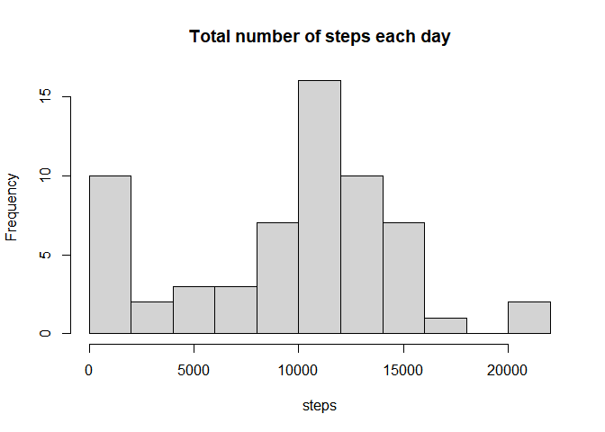
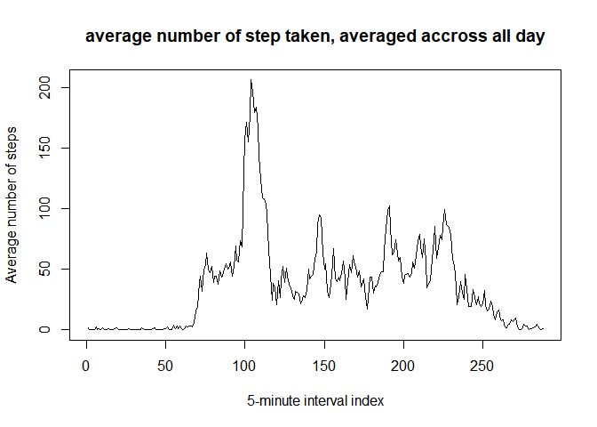
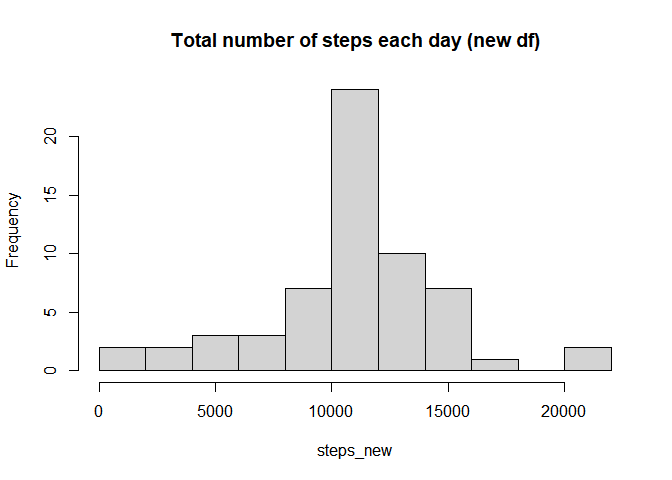
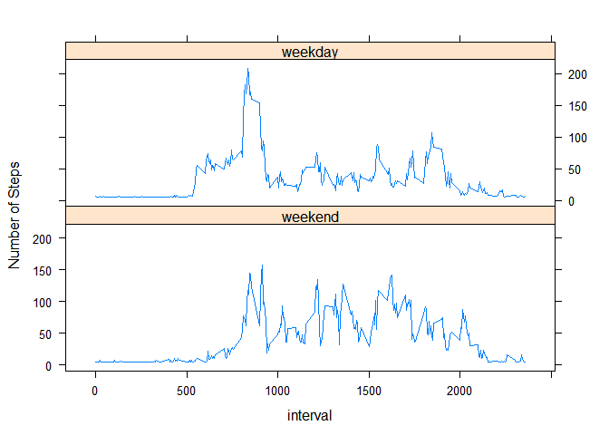

## Loading and preprocessing the data
Unzip the data and read it in using read.csv


```r
unzip(zipfile = "activity.zip", exdir = getwd())
df <- read.csv("activity/activity.csv")
str(df)
```

```
## 'data.frame':	17568 obs. of  3 variables:
##  $ steps   : int  NA NA NA NA NA NA NA NA NA NA ...
##  $ date    : chr  "2012-10-01" "2012-10-01" "2012-10-01" "2012-10-01" ...
##  $ interval: int  0 5 10 15 20 25 30 35 40 45 ...
```

Convert date column to as.Date format

```r
df$date <- as.Date(df$date, format = "%Y-%m-%d")
```

## What is mean total number of steps taken per day?
Calculate total number of steps per day


```r
steps <- tapply(df$steps, df$date, sum, na.rm = TRUE)
```

A histogram histogram of the total number of steps taken each day


```r
hist(steps, breaks = 10, main = "Total number of steps each day")
```

<!-- -->

Mean and Median total number of steps taken per day

```r
meanStep <- mean(steps)
medianStep <- median(steps)
```

```r
print(meanStep)
```

```
## [1] 9354.23
```

```r
print(medianStep)
```

```
## [1] 10395
```


## What is the average daily activity pattern?

Average number of steps taken averaged across all days


```r
timeS <- tapply(df$steps, df$interval, mean, na.rm = TRUE)
```

Time series plot of the 5-minute interval (x-axis) vs. the average number of steps taken, averaged across all day (y-axix)


```r
plot(timeS, type = "l", xlab = "5-minute interval index",
     ylab = "Average number of steps", 
     main = "average number of step taken, averaged accross all day")
```

<!-- -->

The 5-minute interval, on average across all the days in the dataset, contains the maximum number of steps is below. The second number is the index (i.e. 104) of that 5-minute interval, and the first number is the accumulated number of minutes (i.e. 835) 


```r
maxID <- which(timeS == max(timeS))
print(maxID)
```

```
## 835 
## 104
```


## Imputing missing values
Total number of missing values in the dataset 


```r
nanID <- is.na(df$steps)
totNAN <- sum(nanID)
print(totNAN)
```

```
## [1] 2304
```

Calculate average number of steps per day per 5 minutes


```r
avg_steps <- tapply(df$steps, df$date, mean, na.rm = TRUE)
```

Impute the missing data in avg_steps using mean

```r
avg_steps[is.na(avg_steps)] <- mean(avg_steps, na.rm = TRUE)
```

Add a column called "daymean" to the data that will be later used to impute the missing data in the steps column


```r
df$daymean <- rep(as.vector(avg_steps), each=length(df$date)/length(avg_steps))
```

Copy a new data fram and impute the missing data in the steps column using the corresponding data in the daymean column


```r
dfnew <- df
dfnew$steps[nanID] <- dfnew$daymean[nanID]
```


Calculate total number of steps per day using the new df


```r
steps_new <- tapply(dfnew$steps, dfnew$date, sum, na.rm = TRUE)
```

A histogram histogram of the total number of steps taken each day


```r
hist(steps_new, breaks = 10, main = "Total number of steps each day (new df)")
```

<!-- -->

Mean and Median total number of steps taken per day

```r
meanStep_new <- mean(steps_new)
medianStep_new <- median(steps_new)
```

```r
print(meanStep_new)
```

```
## [1] 10766.19
```

```r
print(medianStep_new)
```

```
## [1] 10766.19
```

These values differ from the estimates from the first part of the assignment.And imputing missing data increase the estimates of the total daily number of steps.

## Are there differences in activity patterns between weekdays and weekends?

Use timeDate package to check whether the day is weekday or not


```r
library(timeDate)
```

```
## Warning: package 'timeDate' was built under R version 4.0.3
```

Add a column isWeekDay to the dfnew


```r
dfnew$isWeekDay <- isWeekday(dfnew$date)
```


```r
timeS_new <- data.frame(tapply(dfnew$steps, list(dfnew$interval, dfnew$isWeekDay), mean, na.rm = TRUE))
names(timeS_new) <- c("weekend", "weekday")
timeS_new$interval <- unique(dfnew$interval)
```

Prepare data for panel plot

```r
library(tidyr)
```

```
## Warning: package 'tidyr' was built under R version 4.0.3
```

```r
timeS_new_long <- gather(timeS_new, isWD, steps, weekend:weekday, factor_key = TRUE)
```

Time series plot of the 5-minute interval (x-axis) vs. the average number of steps taken, averaged across all day (y-axix)


```r
library(lattice)
xyplot(steps ~ interval | factor(isWD), data=timeS_new_long, ylab = "Number of Steps", type="l", layout =c(1,2))
```

<!-- -->
